# ACTA — Anybody Can Titrate Antibody

## Overview

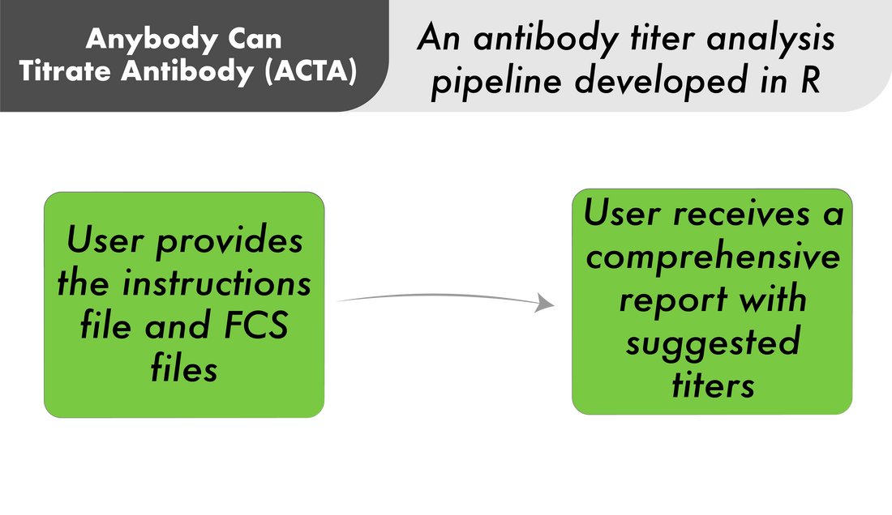

## Introduction & Workflow

This is an automated tool for flow cytometry antibody titer analysis.

The user provides a folder of FCS files, inside a parent folder named `Titration_FCS`, and one
Excel instructions workbook. ACTA gates the positive and negative populations for each titrated
reagent, computes a Stain Index at every stain quantity, fits a saturation curve, and writes the
plots, an export workbook, a PDF report and an HTML dashboard — so the analyst can pick the
reagent titer.

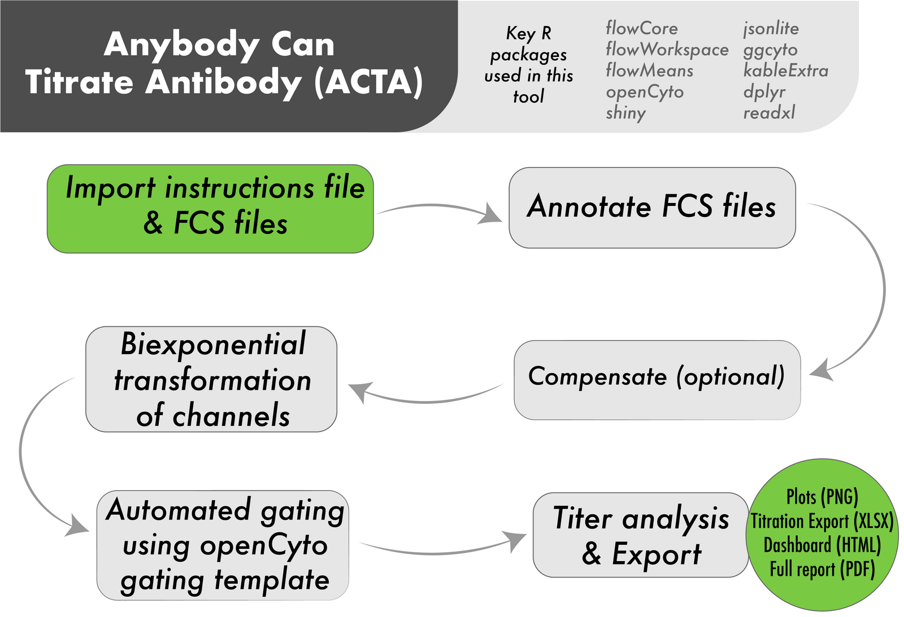

## Outputs

### Plots

1\) A plate map, based on the `Layout_Plate` sheet, generated using the ggplate package.

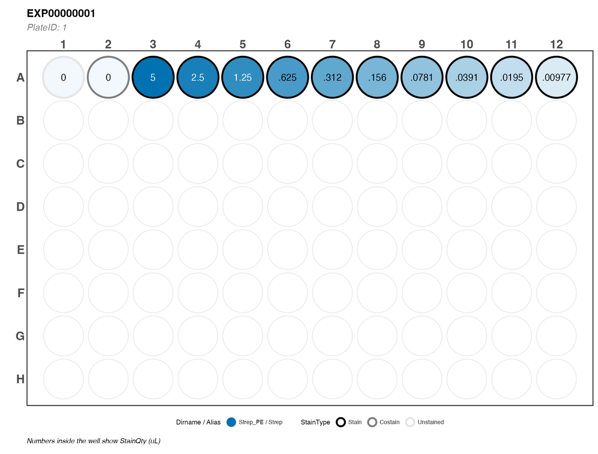

Three plots are provided that help the user pick a titer — 2) a stain index plot, 3) a saturation
plot, and 4) a concatenation plot for each reagent quantity in the group.

| Stain Index against dose | Percent positive against dose | Every well on one axis |
|---|---|---|
| 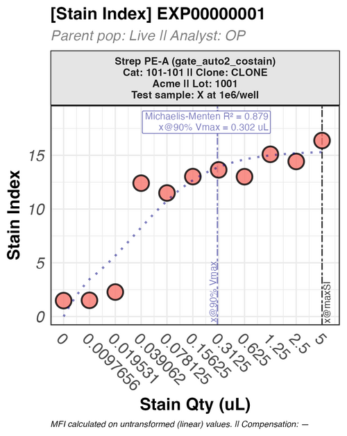 | 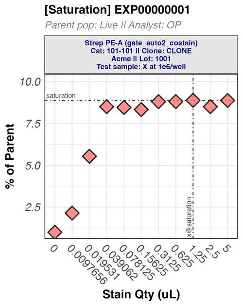 | 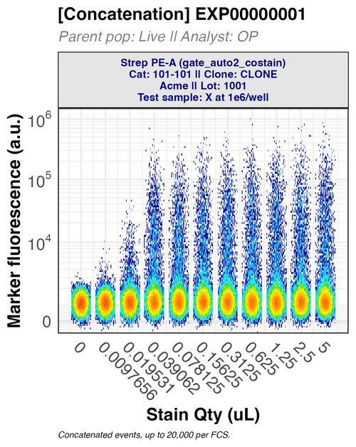 |

Per-reagent panels are also written for each titration — the marker distribution, the pseudocolor,
and one gate-layout page per `gating_template` population flagged `layout_export`.

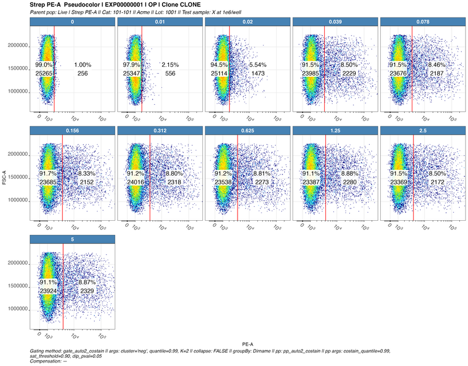

### Titration export

Each export carries two suggested titers: the quantity at maximum Stain Index (`maxSI_StainQty`) and
the quantity at 90% of the Michaelis-Menten *V*max (`MM_90pct_Vmax`). They are suggestions for the
user to pick a titer.

`Titer` and `Titration_Status` inside the titration export file are to be manually filled on the
exported sheet; the dashboard reads them.

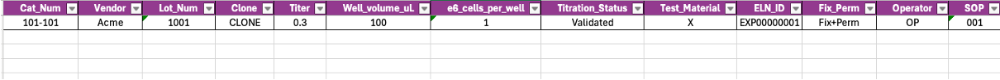

### Dashboard (optional)

An HTML dashboard allows quick retrieval of outputs and metadata from all past titrations.

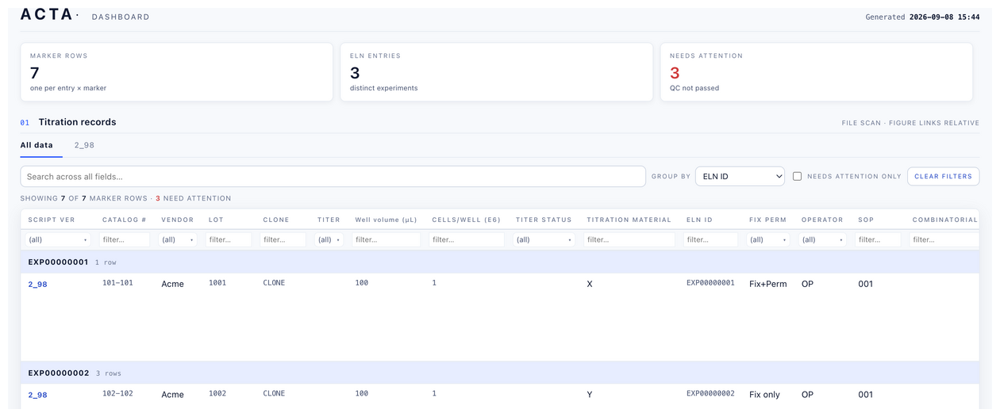

### Report

The PDF report houses two sections — 1) MiFlowCyt-styled metadata and 2) Titration results.
Image shows the table of contents for the report.

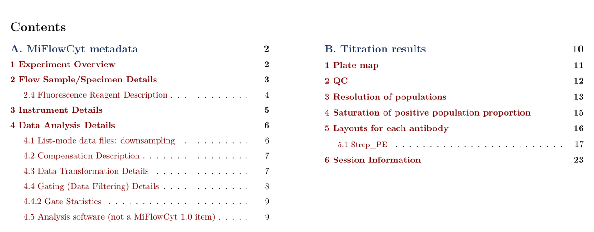

## Expected Advantages

### Analysis time

Titration is arithmetic on a grid: *n* reagents × *m* dilutions. Analyzing using conventional
manual workflows entails annotating every FCS file, drawing every gate, moving medians into Excel,
and rebuilding the same plot for each point.

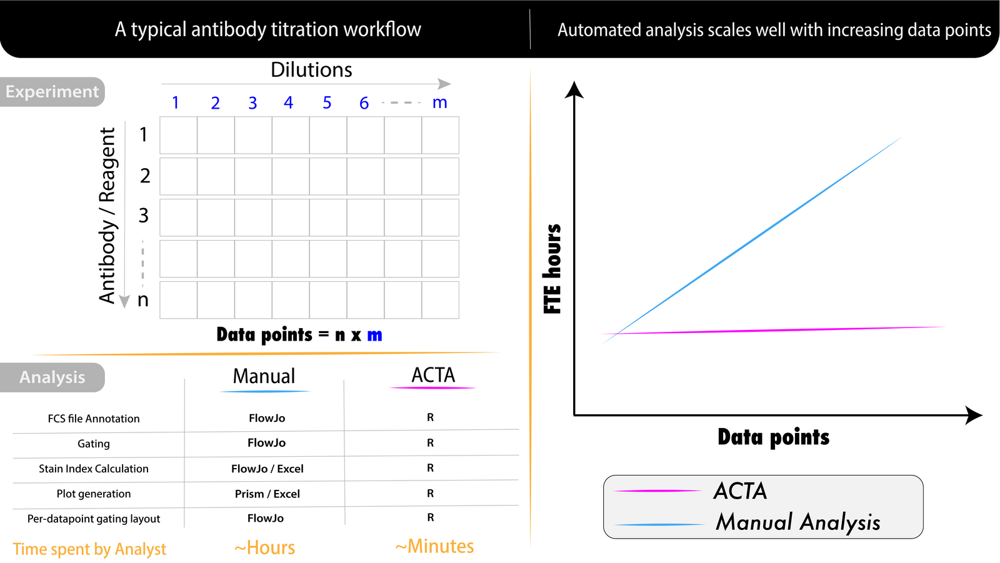

### Deterministic and reproducible

Under identical instructions the outcome is the same, independent of who ran it. Every run records
its own package versions, seed, and script version, and three complete datasets ship with the tool so
that it can be checked for function and accuracy.

### Data provenance

All relevant metadata is captured: reagent vendor, catalogue and lot, clone, test material,
operator, the acquisition date and instrument taken per FCS file, and fixation/permeabilisation
state. The user can add more columns in the Layout sheet that they wish to track.

### Combinatorial titration

Several reagents can be titrated from one shared set of FCS files, each with its own gate and its own
Stain Index curve. `Diagnostics/OQ_Test3` is a worked example. For the experimental approach see
Burn OK, Mair F, Ferrer-Font L. *Combinatorial antibody titrations for high-parameter flow
cytometry.* Cytometry A, 2024. [doi:10.1002/cyto.a.24828](https://doi.org/10.1002/cyto.a.24828)

### Free, open source, and accessible

No licence to buy, and no R experience needed to run it: the Shiny app covers the whole workflow.

### AI-friendly

The instructions file is a spreadsheet and the gating template is plain text, so an LLM can help
fill in a workbook, suggest gating arguments for a panel, or execute `run_acta()`.

## Components

The tool has 2 components: the script and the dashboard generator.

### 1. The script

The script can be run in two ways.

#### With the Shiny app

For anyone who would rather not touch R. `ACTA App.command` (macOS) or `ACTA App.bat` (Windows)
launches it; on Linux run `shiny::runApp("ACTA_App.R")`. Five sections:

| Section | What it does |
|---|---|
| **Checks** | Before anything runs: are the dependencies installed, are the version files resolvable, does the instructions workbook pass pre-validation, and is the dashboard template intact. Each check expands to show what it looked at. |
| **Run ACTA** | Names the workbook it resolved, sets compensation mode, toggles the report and the plots, then runs in a separate process. |
| **Generate dashboard** | Choose the folder to scan for titration exports and where to write the HTML. |
| **Log** | Streams the run as it happens. |
| **Diagnostics** | Runs the three test cases. Collapsed by default. |

#### Directly from R

Every action the app offers is available as a function call.

From an installed package:

```r
library(ACTA)
r <- run_acta("/path/to/working/folder",          # holds the workbook, FCS and outputs
              report = TRUE, plots = TRUE, quiet = FALSE,
              code_dir = system.file("pipeline", package = "ACTA"))
```

Or from a clone, without installing:

```r
h <- new.env(); sys.source("R/ACTA_Functions.R", envir = h)  # helpers only; runs no analysis
r <- h$run_acta("/path/to/working/folder",
                report = TRUE, plots = TRUE, quiet = FALSE,
                code_dir = ".")                              # defaults to the working folder
```

`run_acta()` resolves the pipeline script beside `code_dir`, runs it in its own environment, and
returns a list. The fields you are most likely to branch on:

| field | meaning |
|---|---|
| `ok` | did the <u>analysis</u> complete. `TRUE` with `report_ok = FALSE` means the export and plots are on disk and usable but the PDF render failed |
| `analysis_error` / `report_error` | the message from whichever stage actually failed |
| `export_file`, `plots_dir` | <u>this</u> run's outputs, by the names the script built |
| `script_version`, `seed`, `elapsed_s` | provenance for the run |
| `stats`, `qcList`, `mmFits`, `gs` | the per-well statistics, the QC verdicts, the Michaelis-Menten fits, and the GatingSet |

`ACTA_WORK_DIR` (the working folder) and `ACTA_CODE_DIR` (where the code lives) are set for the
script and are also how the app is pointed at a folder. They differ only when the code is
read-only, such as running from an installed package.

`actaOQRun()` is the same route to the diagnostic cases — see
[Validate your installation](#validate-your-installation).

### 2. The dashboard generator

`ACTA_Dashboard_*.R` is a second pass over work already done, driven either from the app's
**Generate dashboard** section or by running it directly. Point it at a folder whose immediate
subfolders are the runs: each run's `*TitrationExport*.xlsx` is read from the run folder or its
`Outputs/` subfolder, and every run it finds becomes a row in one sortable, filterable HTML table.

- **Cumulative.** Nothing has to be added to a list: any run folder directly under the scanned
  folder is included the next time you generate. To exclude a run, put it in a folder named
  `Archive` — any path containing "archive", in any case and at any depth, is skipped.
- **Local file links** to each run's export, report, and plots, so a row is one click from the
  evidence behind it.
- **Five themes** ship: `graph-blue` in `Template/`, and `lab-record`, `navy-chrome`,
  `maroon-chrome` and `teal-chrome` in `Template/Other_Templates/`. The generator uses whichever
  `*dashboard_template*.html` is in `Template/` and requires exactly one, so switching theme means
  moving the one you want into `Template/` and the current one out.
- **Self-contained HTML.** The data is embedded, so the file can be emailed or archived and still
  opens.

The links are relative file paths. That makes the dashboard ideal for a single computer, or for a
network drive where everyone sees the same paths — and it means a dashboard emailed to someone whose
drive is mounted differently will show rows correctly but broken links.

## Installation

ACTA is an R package. There are two ways to install it.

**As a package**, to drive ACTA from R:

```r
# install.packages("remotes")
remotes::install_github("jatin199517/acta-public")
library(ACTA)
```

This provides `run_acta()` and `actaOQRun()`, and the three diagnostic cases. You can validate the
install straight away — see *Validate your installation* below. pandoc and a TeX engine are not
installed; see the table below.

**From a clone**, for the Shiny app, the desktop launchers and the working folder layout:

```sh
git clone https://github.com/jatin199517/acta-public.git
cd acta-public
```

Then run this **in the folder you cloned into** — the one holding `Setup.R` next to `R/`.

```sh
Rscript Setup.R              # or: Rscript Setup.R --no-tex   to skip the PDF report
```

On **Windows**, double-click `Setup.bat` instead, or run it from a Command Prompt in that folder:

```bat
Setup.bat                    :: or: Setup.bat --no-tex
```

`Setup.bat` exists because the R for Windows installer does not put `Rscript` on `PATH`, so
`Rscript Setup.R` fails there with `'Rscript' is not recognized`; the launcher finds `Rscript.exe`
itself. `source("Setup.R")` from an R console installs the same packages.

`Setup.R` installs the R packages, a TeX engine if there is none, and the LaTeX packages the report
needs. It reads its package list out of `ACTA_Script_*.R`, so that script is the authoritative
manifest.

**Requires R ≥ 4.4.0**, which `Setup.R` enforces before it installs anything.

What each platform needs beyond R:

| | Installed by `Setup.R` | Linux | macOS | Windows |
|---|---|---|---|---|
| **TeX engine** — PDF report only | **Yes** — TinyTeX, plus the LaTeX packages the report needs | installed | installed | installed |
| **pandoc** — PDF report only; `rmarkdown` shells out to it | No — `Setup.R` checks for it and prints the download link | **you install it** — your distro's package, or [pandoc.org](https://pandoc.org/installing.html) | **you install it** — [pandoc.org](https://pandoc.org/installing.html) | **you install it** — [pandoc.org](https://pandoc.org/installing.html) |
| **XQuartz / X11** — `flowMeans` loads `tcltk` | No — `Setup.R` checks for it and prints the download link | usually already present; install your distro's X11 dev libraries if `tcltk` fails to load | **you install it** — [xquartz.org](https://www.xquartz.org) | not needed, `tcltk` ships with R |
| **Perl** — used by `tlmgr` to fetch the report's LaTeX packages | No | system `perl` | system `perl` | not needed, TinyTeX ships its own |
| **Compiler toolchain** — only if a package has no binary | No | `build-essential` + the `-dev` libraries the flow stack names | Xcode command line tools | Rtools |
| **Setup launcher** | Ships with the tool | none — use `Rscript Setup.R` | none — use `Rscript Setup.R` | `Setup.bat` |
| **App launcher** | Ships with the tool | none — use `Rscript` or the R console | `ACTA App.command` | `ACTA App.bat` |

The PDF report needs both a TeX engine and pandoc. `rmarkdown` runs pandoc to turn the report into
LaTeX, then the TeX engine turns that into the PDF. `Setup.R` installs the TeX engine and the LaTeX
packages. It does not install pandoc — it checks for it and reports it in the closing summary.
Install pandoc from [pandoc.org](https://pandoc.org/installing.html).

If you do not want the PDF, skip both and use `run_acta(report=FALSE)`.

## Validate your installation

Three diagnostic cases ship with the tool. A pass means that the run finished and it returned
values as expected.

```r
h <- new.env(); sys.source("ACTA_Functions.R", envir = h)
r <- h$actaOQRun("Diagnostics/OQ_Test1")
r$verdict        # "PASS", "PASS (with notes)" or "FAIL"
```

They are also the worked examples. If you want to see a correct instructions workbook, read theirs.

Each dataset covers a unique test case, across two instruments from different vendors:

| | **OQ_Test1** | **OQ_Test2** | **OQ_Test3** |
|---|---|---|---|
| Instrument | Cytek Aurora | Bio-Rad ZE5 | Cytek Aurora |
| Detectors in the file | 13 | 32 | 14 |
| Titrations / wells | 1 / 11 | 3 / 21 | 3 / 14 |
| Events per well | 60,000 | 12,000 | 20,000 |
| Compensation | none | **matrix from CSV** | none |
| Combinatorial titration | no | no | **yes** |
| What it covers | the whole path end to end, single reagent | a second vendor's channel naming (`FS00-A`, not `FSC-A`) and the compensation path | **combinatorial titration** — one set of FCS files carrying two independently titrated reagents |

## Running

Copy the blank instructions workbook out of `Template/` and fill it in. You may replace the text
`TEMPLATE` from this file but keep the rest of the filename as is. Move your FCS files to a
folder (as specified in `Dirname` in the Layout sheet) and move this folder inside the umbrella
folder `Titration_FCS`. Then either launch the app or call `run_acta()`. The script resolves and
sets its own working directory.

The entire gating hierarchy — including each reagent's marker gate and the method used — is
configured in the workbook's **`gating_template`** sheet, which is an openCyto gating template. It
is not configured in code.

> **Reagent.** This tool refers to "Reagent" as any staining reagent, which includes both antibody
> and non-antibody staining reagents, such as fluorophore-conjugated streptavidin and tetramers.

## Inputs

The instructions workbook has three sheets. Here is what the tool does with the instructions
workbook sheets:

| Step | Sheet | What it reads | Fails the run if |
|---|---|---|---|
| 1 | `Layout_Plate` | one row per well: `PlateID`, `Row`, `Column`, `Dirname`, `Alias`, `StainType`, `StainQty` | `Dirname` is empty everywhere, or `Fix`/`Perm` are missing |
| 2 | `Layout_Plate` | the titrated channel per reagent: `Markername ($PnS)` and/or `Channel ($PnN)` | neither column is present |
| 3 | `Layout_Plate` | reagent metadata for the labels and the export: `Vendor`, `Cat_Num`, `Lot_Num`, `Clone`, `Test_Material` | never — these are display-only |
| 4 | `gating_template` | the openCyto hierarchy, one row per population, with exactly one aliased `Reagent` row | there is no marker row, or `dims`/`pop` cannot be parsed |
| 5 | `gating_template` | `gating_args` / `preprocessing_args` | they contain anything that is not a literal value |
| 6 | `Info` | run-level settings: compensation mode, optional per-run event cap | a setting is present but unreadable |

> **Exactly one `gating_template` row must be aliased `Reagent`.** That is the row whose channel is
> titrated: its `dims` names the detector, and its gating method decides the positive population the
> Stain Index is computed from. `Antibody` is accepted as a legacy alias for the same row.

Column headers can contain the suffix `(L)` or `(N)` to denote that a logical (TRUE/FALSE) or a
numeric value is expected.

### Instructions workbook column requirement and case-sensitivity

| Column | Sheet | Case-sensitive | Required — the run stops without it |
|---|---|---|---|
| `Dirname` | `Layout_Plate` | No | Yes — matches each well to its folder of FCS files |
| `PlateID`, `Row`, `Column` | `Layout_Plate` | No | Yes — matches each FCS file to its well, via `$WELLID` |
| `StainType` | `Layout_Plate` | No | Yes — tells Stain, Costain and Unstained wells apart |
| `StainQty` | `Layout_Plate` | No | Yes — the x axis of every curve |
| `Markername ($PnS)` <u>or</u> `Channel ($PnN)` | `Layout_Plate` | No | Yes — either will do; `Channel` wins if both are set |
| `Fix`, `Perm` | `Layout_Plate` | No | Yes — the export's `Fix_Perm` column. `Perm` true with `Fix` false is rejected as a layout error |
| `alias`, `parent`, `pop` | `gating_template` | **Yes** | Yes — they become openCyto node names |
| `groupBy` | `gating_template` | **Yes** | No — but when used it must name a `pData` column exactly |

## Files written

| Output | File |
|---|---|
| Stain Index curve | `Plots/SIPlot_*.png` |
| Saturation curve | `Plots/SatPlot_*.png` |
| Per-reagent panels | `Plots/*_histogram.png`, `*_pseudo.png`, `*_layout_<alias>.png` |
| Concatenation view | `Plots/ConcatPlot_*.png` |
| Plate map | `Plots/PlateMap_<ELN_ID>_<PlateID>.png` |
| Titration export | `<date>_<ELN_ID>_TitrationExport_<version>.xlsx` |
| Report | `ACTA_Report_*.pdf` |
| Dashboard | a self-contained `.html` |

## Licence

ACTA — automated antibody titration and stain-index analysis for flow cytometry.
Copyright (C) 2026 Lyell Immunopharma, Inc.

Published from a personal repository with the permission of Lyell Immunopharma, Inc., which
retains copyright. **No separate licence from Lyell is required to use ACTA** — the AGPL-3 grant
below is the whole permission you need.

This program is free software: you can redistribute it and/or modify it under the terms of the GNU
Affero General Public License, **version 3 only** — not "or any later version", because openCyto and
flowWorkspace are themselves `AGPL-3.0-only`. The full text is in [LICENSE](LICENSE).

This program is distributed in the hope that it will be useful, but WITHOUT ANY WARRANTY; without
even the implied warranty of MERCHANTABILITY or FITNESS FOR A PARTICULAR PURPOSE. See the GNU
Affero General Public License for more details.

AGPL is copyleft: a modified version, or a work based on ACTA, that you distribute carries the same
licence. The licence covers the software and grants no trademark rights.

## Citing ACTA

Use the **Cite this repository** button, or [CITATION.cff](CITATION.cff) directly.

## Further reading

[`docs/INTERNALS.md`](docs/INTERNALS.md) documents the pipeline stage by stage — startup, the
per-reagent loop, marker-channel resolution, compensation, the dashboard, and the helper library.
Read it if you are planning to extend ACTA.
